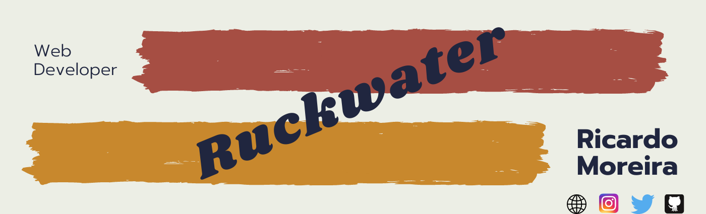
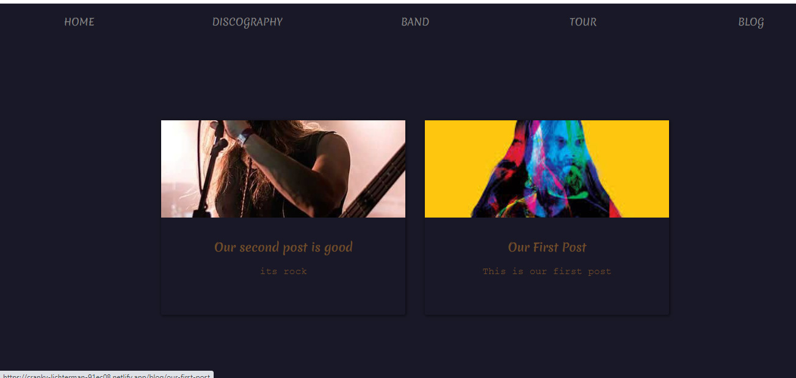

<h1 align="center"> 🔥Ruckwater🔥</h1>

<h2 align="center"> A website for a music group made with Nuxt </h2>

### Index

* [Name](####Name) 👈
* [Links](####Links) 🔗
* [Description](####Description) 📖
* [Languages and Frameworks](####Languages-and-Frameworks) ⚙️
* [Screenshots](####Screenshots) 📱
* [Instalation](####Instalation) 🧩
* [Support](####Support) 🆘
* [Roadmap](####Roadmap) 🗺️
* [Authors and acknowledgment](####Authors-and-acknowledgment) ✍️
* [Project Status](####Project-Status) 📜

#### Name 👈

Ruckwater

#### Links 🔗

[Website](https://cranky-lichterman-91ec08.netlify.app/)

[Presentation](https://www.ricardomoreira.io/projects/2020-06-02-nuxt-website/)
___

#### Description 📖

My first real approach to Nuxt and headless CMS.
It's built with Storyblok as CMS and with Nuxt. It includes a blog, a tour page and a discography all stored with Storyblok.

___

#### Languages, Frameworks and others ⚙️

* **Nuxt.js** - Framework
* **Storyblok** - Headless CMS
* **Font Awesome** - Icons
* **date-fns** - Date library

____

#### Screenshots 📱

____

#### Instalation 🧩

___

#### Support 🆘

Have any question or find something that doesn't look good? Let's talk 😊

[Here](https://github.com/mugas)

[And Here](https://www.ricardomoreira.io/about)

____

#### Roadmap 🗺️

For now the page is done, But it will improved in the future. No features yet decided to be added

____

#### Authors-and-acknowledgment ✍️

* [Based on this](https://www.youtube.com/watch?v=Dc_5BpIB4X4)

* Me 😊

____

#### Project-Status 📜

Done. It will be improved in the future with more features.

____
